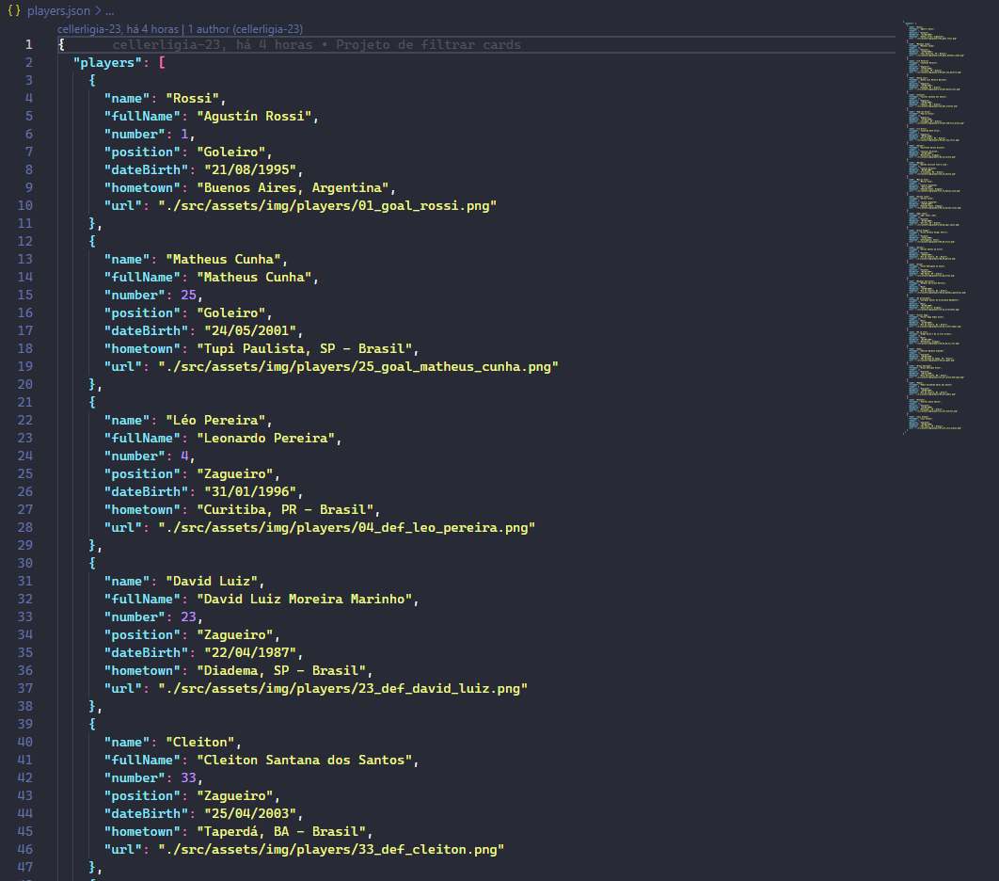
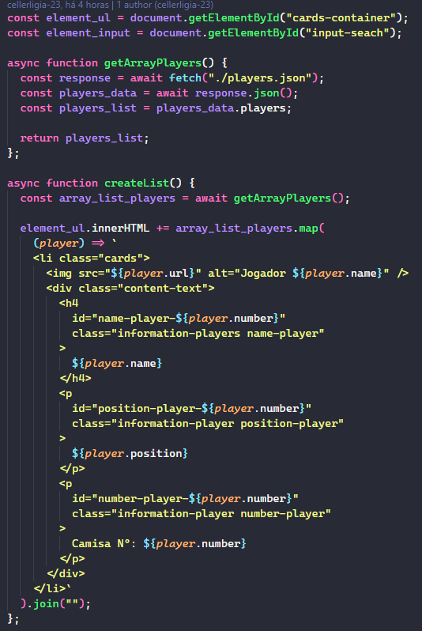
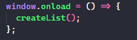
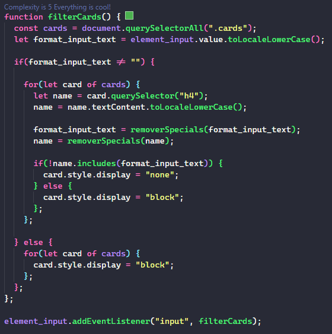
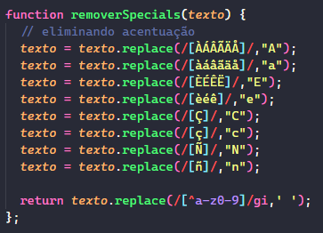

#  PROJETO DE FILTRO DE CARDS 

Aqui você vai encontrar um pequeno projeto em HTML, CSS e JavaScript. Esse projeto mostra um filtro de cards. Criei cards dos jogadores do **Flamengo** e é possível encontrar o jogador através do input de pesquisa.

 
   
  

## DESCRIÇÃO DO PROJETO :computer:

Uso o JavaScript para criar dinamicamente os cards e para fazer o filtro.

No arquivo JSON **(players.json)** está as informações dos jogadores. Acesso ele com as funções **assíncronas** e com a função **map()** crio os cards.

 

 
  
  

 

Na função de filtro, uso o **FOR OF** para percorrer todas as tags li criadas e pegar o nome do jogador e vê se é o mesmo que estou buscando.

Também coloquei uma função para tirar os caracteres especiais (acentuação), para o filtro ser mais específico.

 

 
  

 

### GIF DO PROJETO

 

 
 

 
 

:smile: **<a href="https://cellerligia-23.github.io/filter_cards/">Página do projeto Filter Cards</a>** :blush:

